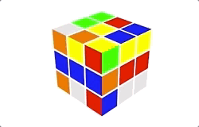

# Freecube
⚛ Solve Rubik's Cube with WebGL in 10KB.


Freecube renders and animates Rubik's Cube with raw WebGL, plus a tiny rule-based solver showing how CFOP works.




## Usage

```
npm install freecube
```

``` js
import { Cube, Solver } from 'freecube'

const canvas = document.querySelector('#gl')
const cube = new Cube(canvas)
const solver = new Solver(cube)

cube.render(30, -45) // Render the cube with X and Y rotation.
cube.shuffle(20, true) // Shuffle it with animation.
solver.solve() // Generate solution with CFOP algorithm.
```


## API

### `Cube`
`new Cube(canvas: CanvasElement, moves: Moves)`

Main class emulating Rubik's Cube, it maintains cube state in `this.blocks` and optional WebGL instance in `this.gl`.

* `canvas` - DOM canvas element for rendering, can be null for "headless" case.
* `moves` - Array of cube moves, .e.g., `['R', 'U', 'F']`.

#### `animate`
`(move: String|Moves, duration: number) => Promise`

Animate the cube moves with single or multi `move`, uses `cube.move` under the hood. you can set move speed with optional `durataion` args. The promise returned will be resolved on animation ends.

#### `getBlock`
`(coord: Coord) => Block`

Get block data in the cube. `coord` shapes as `[0, 1, -1]` and the block returns in `{ positions: Array, colors: Array }` format. `block.positions` is the vertex positions of the block, and `block.colors` represents block colors in `[F, B, U, D, R, L]` sequence.

#### `move`
`(move: String|Moves) => Cube`

Update cube state with moves passed in, uses `cube.rotate` under the hood. Just use it as `animate` without animation. Chain calling like `cube.move('U').move('R')` is supported.

> Only `F / B / L / R / U / D` and their counter moves can be used for now. "Advanced" turns like `M / r / x / R2` are not supported.

#### `rotate`
`(center: Coord, clockwise: boolean) => Cube`

Rotate cube face in 90 degree. `center` coord is the center block of the face, `clockwise` for rotate direction.

#### `render`
`(rX: number, rY: number, moveFace: String, moveAngle: number)`

Renders the cube with `rX` and `rY` as overall rotation, and `moveFace` and `moveAngle` for a cube face rotation.

#### `shuffle`
`(n: number, animate: false) => Cube|Promise`

Shuffles the cube. Returns cube instance if animation not used, and promise on shuffle animation ends.

### `Solver`
Rule-based module solving Rubik's Cube with CFOP algorithm.

#### `solve`
`() => Array<Moves>`

Solve the cube state with all CFOP steps. Returns array of 4 series of moves.

#### `solveCross`
`() => Moves`

Returns the moves to build a cross.

#### `solveF2L`
`() => Moves`

Returns the moves to build first two layers.

#### `solveOLL`
`() => Moves`

Returns the moves to pass OLL.

#### `solvePLL`
`() => Moves`

Returns the moves to pass PLL.


## License
MIT
